# 🚀 EngageHub - Full-Stack Community Engagement Platform


> A production-ready SaaS platform showcasing enterprise-grade architecture, performance optimization, and modern web development practices.

[](https://nextjs.org/)
[](https://www.typescriptlang.org/)
[](https://engagehub-gamify.vercel.app/?stable=true)

<p align="center">
  <a href="https://engagehub-gamify.vercel.app/?stable=true">
    
  </a>
</p>

---

## 🎯 Technical Overview

EngageHub is a **full-stack community engagement platform** that demonstrates advanced software engineering practices, scalable architecture, and production-ready development. This project showcases expertise in modern web development, performance optimization, state management, and building complex user-facing applications.

### 🏗️ System Architecture

```mermaid
graph TB
    %% User Interactions
    Users["`👥 **Users via Browser**
    Web Interface Access`"]
    Admins["`👨‍💼 **Admins via Django Admin UI**
    Administrative Control Panel`"]
    
    %% Frontend Layer
    subgraph Frontend[" "]
        FrontendTitle["`☁️ **Frontend Deployment - Vercel Cloud Platform**`"]
        NextJS["`⚛️ **Next.js Frontend**
        React 18 • TypeScript • Tailwind • 🚀 Vercel`"]
        FrontendTitle ~~~ NextJS
    end
    
    %% Backend Container
    subgraph Backend[" "]
        BackendTitle["`🐳 **Render.com Container - Cloud Infrastructure**`"]
        Django["`🐍 **Django Backend**
        Python • REST API • JWT Auth • ⚙️ gunicorn`"]
        DB[("`🗄️ **PostgreSQL Database**
        Relational Data Storage • ☁️ Supabase`")]
        DiscordBot["`🤖 **Discord Bot**
        Python • Real-time Integration • 📄 bot.py`"]
        BackendTitle ~~~ Django
        BackendTitle ~~~ DB
        BackendTitle ~~~ DiscordBot
    end
    
    %% External Services
    DiscordServer["`💬 **Discord Server**
    External Communication Platform`"]
    
    %% User Connections
    Users -.->|"`HTTP/JWT
    Authenticated Requests`"| NextJS
    Admins -.->|"`HTTP/JWT
    Admin Interface`"| NextJS
    Admins -.->|"`Django Admin UI
    Direct Management`"| Django
    
    %% Frontend to Backend
    NextJS <==>|"`HTTP/JWT
    RESTful API Communication`"| Django
    
    %% Backend to Database
    Django ==>|"`ORM
    Object-Relational Mapping`"| DB
    DiscordBot ==>|"`ORM
    Data Persistence`"| DB
    
    %% Discord Integration
    DiscordBot <==>|"`Discord API
    Real-time Events & Commands`"| DiscordServer
    
    %% Modern Styling with Premium Colors
    classDef userStyle fill:#667eea,stroke:#5a67d8,stroke-width:3px,color:#fff
    classDef frontendStyle fill:#4facfe,stroke:#3182ce,stroke-width:3px,color:#fff
    classDef backendStyle fill:#43e97b,stroke:#2d7d32,stroke-width:3px,color:#000
    classDef databaseStyle fill:#fa709a,stroke:#e91e63,stroke-width:3px,color:#000
    classDef externalStyle fill:#a8edea,stroke:#9c27b0,stroke-width:3px,color:#000
    classDef containerStyle fill:#2d3748,stroke:#1a202c,stroke-width:4px,color:#fff
    classDef titleStyle fill:#1a202c,stroke:#4a5568,stroke-width:2px,color:#fff
    
    %% Apply styles
    class Users,Admins userStyle
    class NextJS frontendStyle
    class Django,DiscordBot backendStyle
    class DB databaseStyle
    class DiscordServer externalStyle
    class Frontend,Backend containerStyle
    class FrontendTitle,BackendTitle titleStyle
```



---

## 🏗️ Architecture & Technical Stack

### **Backend (Django REST Framework)**
```
Python 3.10+ | Django 4.2 | PostgreSQL 13+ | Redis
```

**Key Technical Implementations:**
- **Direct ORM Integration**: Eliminated HTTP overhead by sharing Django ORM between bot and API
- **Advanced Caching Layer**: Implemented multi-level caching with cache invalidation for 1000+ concurrent users
- **Optimized Database Queries**: N+1 query elimination, strategic indexing, connection pooling
- **JWT Authentication**: Secure token-based auth with refresh token rotation
- **Admin Workflow Engine**: Custom approval pipeline with state management and audit trails
- **API Documentation**: Auto-generated OpenAPI/Swagger specs with drf-spectacular

**Database Design:**
- 15+ interconnected models with complex relationships
- Optimized migrations with data integrity constraints
- Full-text search capabilities with PostgreSQL
- Time-series data handling for analytics
- Soft deletes and audit logging across all tables

### **Discord Bot (discord.py)**
```
discord.py 2.x | Async/Await | Multi-Cog Architecture
```

**Advanced Bot Features:**
- **Async Context Management**: Proper async/await patterns with `sync_to_async` for ORM operations
- **Multi-Cog Architecture**: 5 modular cogs handling 20+ commands with hot-reloading
- **Interactive Components**: Discord Buttons, Modals, Select Menus for rich admin UX
- **Event-Driven Processing**: Real-time activity detection and point calculation
- **Error Handling & Recovery**: Comprehensive error handling with automatic reconnection logic
- **Rate Limiting**: Built-in abuse prevention and quota management

### **Frontend Integration**
```
Next.js | Vercel | REST API Integration
```
- **Live Production Deployment**: [Frontend Dashboard](https://engagehub-gamify.vercel.app/?stable=true)
- Real-time data sync with backend API
- Responsive design with modern UI/UX patterns
- JWT-based authentication flow

---

## 🎯 Technical Highlights

### **Performance & Scalability**
```python
# Optimized leaderboard query with caching
@cached(timeout=3600, key_prefix="leaderboard")
def get_leaderboard(limit=100):
    return User.objects.select_related('profile')\
        .annotate(total_points=Sum('pointslog__points'))\
        .order_by('-total_points')[:limit]
```

- **Sub-100ms API response times** with strategic caching
- **Database connection pooling** for high concurrency
- **Batch processing** for daily metrics aggregation
- **Index optimization** on frequently queried fields
- Designed to scale to **10K+ active users** without architectural changes

### **Code Quality & Best Practices**

**✅ Implemented:**
- Type hints and docstrings throughout codebase
- Modular architecture with separation of concerns
- DRY principles with reusable utility functions
- Environment-based configuration (12-factor app)
- Comprehensive error handling and logging
- Security best practices (CORS, CSRF, rate limiting)

**📊 Codebase Stats:**
- **22,487 lines** of production code
- **76 files** across modular architecture
- **24 database migrations** with full reversibility
- **20+ Discord commands** with validation and error handling
- **5 cog modules** with clear separation of concerns

### **Complex Features Implemented**

#### 1. **Dynamic Submission System**
```python
# 12 different submission types with polymorphic handling
submission_types = {
    'event': EventSubmission,
    'resource': ResourceSubmission,
    'linkedin': LinkedInSubmission,
    'workshop': WorkshopSubmission,
    # ... 8 more types
}
```
- Each submission type has unique validation rules
- Polymorphic models with shared base class
- Admin approval workflow with state machine
- Automatic point calculation and attribution

#### 2. **Real-Time Analytics Pipeline**
```python
class DashboardStatsView(APIView):
    """
    Real-time analytics with:
    - Period-over-period comparisons
    - Activity categorization
    - Trend detection
    - Leaderboard generation
    """
```
- Aggregation queries optimized for speed
- Cached results with smart invalidation
- Time-series data visualization support
- Export capabilities for CSV/JSON

#### 3. **Professional Review Matching Algorithm**
```python
def find_availability_matches(student_slots, professional_slots):
    """
    Intelligent scheduling algorithm:
    - Timezone conversion
    - Natural language parsing ("Monday afternoon")
    - Conflict detection
    - Match scoring (0-100)
    """
```
- Google Calendar integration
- Automated email notifications
- Availability conflict resolution

#### 4. **Discord Verification & Anti-Hijacking**
```python
class DiscordVerification(models.Model):
    """
    Two-factor verification system:
    - Time-based verification codes
    - Rate limiting (3 attempts)
    - Automatic cleanup of expired codes
    - Account takeover prevention
    """
```

---

## 🔧 Engineering Decisions

### **Why Direct Database Integration?**
Initially designed with HTTP API calls between bot and backend. Refactored to shared ORM access for:
- **Performance**: Eliminated network overhead (~50ms per request)
- **Reliability**: No HTTP timeouts or connection failures
- **Simplicity**: Single source of truth, no data synchronization issues
- **Cost**: Reduced infrastructure complexity

### **Async Architecture**
```python
# Proper async/await pattern with Django ORM
@sync_to_async
def get_user_points(discord_id):
    return User.objects.get(discord_id=discord_id).total_points

async def handle_command(ctx):
    points = await get_user_points(str(ctx.author.id))
    await ctx.send(f"You have {points} points!")
```

### **Database Indexing Strategy**
```sql
-- Strategic indexes for query optimization
CREATE INDEX idx_pointslog_user_date ON core_pointslog(user_id, created_at);
CREATE INDEX idx_submissions_status ON core_submission(status, created_at);
CREATE INDEX idx_discord_id ON core_user(discord_id);
```

---

## 📦 Deployment & DevOps

### **Production-Ready Features**
- **Docker Support**: Multi-stage builds for optimized images
- **Environment Management**: django-environ for secure configuration
- **Process Management**: Gunicorn with worker configuration
- **Database Migrations**: Zero-downtime migration strategies
- **Monitoring**: Comprehensive logging with structured output
- **Security**: HTTPS enforcement, secure headers, SQL injection prevention

### **Deployment Targets**
- **Backend**: Render, Heroku, Railway, AWS ECS
- **Frontend**: Vercel (currently deployed)
- **Database**: Supabase, AWS RDS, managed PostgreSQL
- **Bot**: Background worker process alongside API

### **Quick Start**
```bash
# Clone and setup
git clone https://github.com/extraordinary-yh/engagehub-backend-bot.git
cd engagehub-backend-bot

# Environment setup
python -m venv venv
source venv/bin/activate
pip install -r requirements.txt

# Configure .env
cp .env.template .env
# Edit .env with your credentials

# Database setup
python manage.py migrate
python manage.py createsuperuser

# Run services (requires 2 terminals)
python manage.py runserver  # Terminal 1: Django API
python bot.py              # Terminal 2: Discord Bot
```

---

## 🎨 Key Features Showcase

### **For End Users**
- **20+ Command System**: Event submissions, resource sharing, LinkedIn tracking, workshops
- **Tiered Rewards**: 4-tier reward system (5-1000 points)
- **Live Leaderboards**: Real-time rankings with privacy controls
- **Progress Tracking**: Detailed points history and activity logs
- **Automated Point Distribution**: Daily activity bonuses
- **Resume Review System**: Professional matching and scheduling

### **For Admins**
- **Approval Dashboard**: Bulk approval/rejection with reason tracking
- **Interactive Controls**: Discord buttons for one-click moderation
- **Analytics Suite**: Engagement metrics, retention cohorts, activity heatmaps
- **Reward Management**: Inventory tracking, stock levels, sponsor attribution
- **User Management**: Points adjustment, manual registration, role assignment

### **For Developers**
- **RESTful API**: Comprehensive endpoints with filtering and pagination
- **Webhook Support**: Google Forms integration for external data
- **Extensible Architecture**: Easy to add new submission types or commands
- **Admin Interface**: Django admin customizations for data management

---

## 📈 Market Applications

Built as a template for multiple B2B SaaS opportunities:

**Discord Communities** ($10-50/month) • **Creator Platforms** (marketplace model) • **Online Education** ($350B market) • **SaaS PLG** (enterprise pricing) • **Brand Communities** (retainer model)

---

## 🧪 Testing & Quality

```bash
# Test suite includes
tests/
├── discord/          # Discord bot command testing
├── integration/      # Full system integration tests
└── README.md        # Testing documentation
```

**Implemented:**
- Unit tests for core business logic
- Integration tests for Discord commands
- API endpoint testing scripts
- Live testing utilities with webhook notifications

---

## 📚 Technical Documentation

```
docs/
├── DEPLOYMENT_SECURITY_ENHANCEMENTS.md  # Production security guide
├── Student Portal Design.md             # UX/UI specifications
└── README.md                           # Architecture overview
```

**Scripts & Utilities:**
- `scripts/create_sample_data.py` - Database seeding
- `scripts/deploy_scheduling_system.py` - Automated deployment
- `scripts/update_rewards_comprehensive.py` - Reward catalog management
- `scripts/availability_matcher.py` - Scheduling algorithm
- `scripts/calendar_integration.py` - Google Calendar sync

---

## 🔑 Technical Skills Demonstrated

**Backend Development:**
- Python, Django, Django REST Framework
- PostgreSQL, Redis, database design
- API design, JWT authentication
- Caching strategies, query optimization

**Async Programming:**
- discord.py, asyncio
- Async/await patterns
- Event-driven architecture
- Concurrent request handling

**System Architecture:**
- Microservices patterns
- ORM vs. HTTP trade-offs
- Scalability considerations
- Production deployment

**DevOps:**
- Docker containerization
- Environment management
- CI/CD considerations
- Monitoring and logging

**Best Practices:**
- Clean code principles
- Documentation
- Error handling
- Security hardening

---

## 🚀 Live Demo

**Frontend Dashboard:** [engagehub-gamify.vercel.app](https://engagehub-gamify.vercel.app/?stable=true)

**Features to explore:**
- User registration and authentication
- Points system and leaderboards
- Reward catalog with redemption flow
- Activity timeline and analytics
- Profile management

---

## 📫 Contact & Portfolio

Built to showcase full-stack development capabilities for:
- **Tech Recruiters**: Demonstrating production-ready code and architectural decisions
- **Founders**: Validating technical execution for early-stage opportunities
- **Engineering Teams**: Showcasing collaborative development and best practices

**Tech Stack Summary:**
`Python` • `Django` • `PostgreSQL` • `Discord.py` • `JWT` • `REST API` • `Docker` • `Git` • `Next.js` • `Vercel`

---

## 📄 License

MIT License - Feel free to fork and customize for your use case.

---

*This project represents 22K+ lines of production-quality code, demonstrating full-stack development, system design, and DevOps capabilities.*
